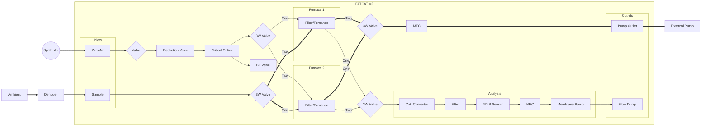

# FATCAT V2 Diagram

```mermaid
graph LR
   subgraph FATCAT V2
         subgraph Inlets
                  Zero[Zero Air]
                  Sample
                  end
         subgraph Outlets
                  PO[Pump Outlet]
                  FD[Flow Dump]
                  end
         subgraph Furnace 1
                  F1[Filter/Furnance]
                  end
         subgraph Furnace 2
                  F2[Filter/Furnance]
                  end
         subgraph Analysis
                  Cat[Cat. Converter]
                  F3[Filter]
                  CO2[NDIR Sensor]
                  MFC1
                  IP[Membrane Pump]
                  Cat --> F3
                  F3 --> CO2
                  CO2 --> MFC1[MFC]
                  MFC1 --> IP
                  end
         SV{3W Valve}
         RV[Reduction Valve]
         CO[Critical Orifice]
         BF[BF Valve]
         VZ{Valve}
         ZV{3W Valve}
         SV2{3W Valve}
         Zero --> VZ
         VZ --> RV
         RV --> CO
         CO --> BF
         CO --> ZV
         Sample ==> SV
         ZV --> |One| F1
         ZV --> |Two| F2
         SV ==> |Two| F1
         SV ==> |One| F2
         AV{3W Valve} --> Cat
         F1 --> |One| AV
         F2 --> |Two| AV
         IP --> FD
         F1 ==> |Two| SV2
         F2 ==> |One| SV2
         SV2 ==> MFC2[MFC]
         MFC2 ==> PO
   end
D((Synth. Air)) --> Zero
A[Ambient] ==> Denuder
Denuder ==> Sample
PO ==> Pump[External Pump]
```
