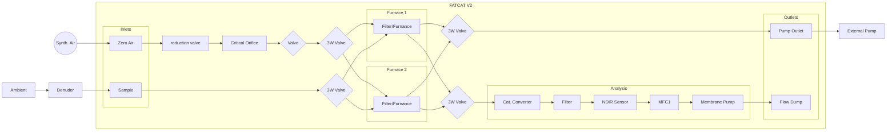

# FATCAT V2 Diagram

```mermaid
graph LR
   subgraph FATCAT V2
         subgraph Inlets
                  Zero[Zero Air]
                  Sample
                  end
         subgraph Outlets
                  PO[Pump Outlet]
                  FD[Flow Dump]
                  end
         subgraph Furnace 1
                  F1[Filter/Furnance]
                  end
         subgraph Furnace 2
                  F2[Filter/Furnance]
                  end
         subgraph Analysis
                  Cat[Cat. Converter]
                  F3[Filter]
                  CO2[NDIR Sensor]
                  MFC1
                  IP[Membrane Pump]
                  Cat --> F3
                  F3 --> CO2
                  CO2 --> MFC1
                  MFC1 --> IP
                  end
         SV{3W Valve}
         RV[reduction valve]
         CO[Critical Orifice]
         VZ{Valve}
         ZV{3W Valve}
         Zero --> RV
         RV --> CO
         CO --> VZ
         VZ --> ZV
         Sample --> SV
         ZV --> F1
         ZV --> F2
         SV --> F1
         SV --> F2
         AV{3W Valve} --> Cat
         F1 --> AV
         F2 --> AV
         IP --> FD
         F1 --> SV2
         F2 --> SV2
         SV2{3W Valve}
         SV2 --> PO
   end
D((Synth. Air)) --> Zero
A[Ambient] --> Denuder
Denuder --> Sample
PO --> Pump[External Pump]
```
