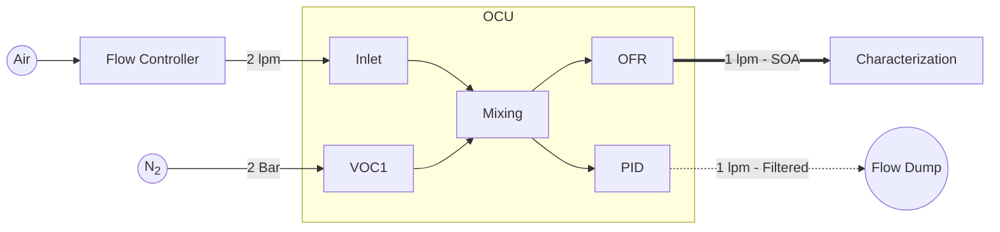
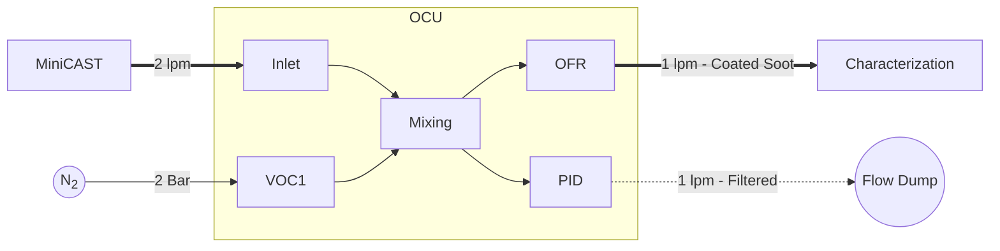

# Organic Coating Unit: Quick Start Manual

# Introduction

## Preparing the OCU for operation

This short guide will take you through the necessary steps for your first production of secondary organic aerosol (SOA) particles.

### Additional Material

1. Precursor VOC (e.g. α-pinene)
2. High purity VOC-Free Synthetic air (e.g., Carbagas ALPHAGAZ™ 1 Air)
3. Flow controller capable of delivering 2 lpm (e.g., Mass flow controller, critical orifice, etc.).
4. Recommended: Innert gas (e.g. N2) for purging of the oxidation flow reactor
5. Recommended: Festo blanking plugs for 6mm outer diameter tube (part Nr. QSC-6H)
6. Optional: Ultra pure water (e.g. Milli-Q) for humidity experiments

### Purging the oxidation flow reactor

The oxidation flow reactor consist of a UV-grade quartz tube surrounded by 5 mercury lamps. The reactor can be purged with an oxigen free gas, like N2, to avoid the formation of Ozone outside of the reaction area. The purge inlet is located at the back of the OCU. It is enough to apply a low flow (e.g. 1 lpm) for 60 seconds in order to fill the reactor with the innert gas. The OCU is equipped with backflow prevention valves in order to keep the innert gas in the reactor. This opperation can be performed once a week.

||
|:--:| 
|*Inlet for purging the oxidation flow reactor of the OCU. This procedure avoids the formation of ozone outside of the reaction area. Backflow prevention valves keep the innert gas in the reactor area for several days.*|

### Gas for VOC dosing

The OCU is equiped with two connectors for the VOC carrier gas. This way, it is possible to choose different gases for the two dosing systems or use premixed gas samples (for instance an NO2 mixture instead of the second dosing loop). The VOC1 and VOC2 connectors correspond to the bottles marked with those names at the side of the device. **The dosing gas connectors should be used with an operation pressure of 2 Bars**. Inlets that are not in use should be closed with a  blanking plug to avoid contamination.

||
|:--:| 
|*Connection of the carrier gas for the VOC1. The VOC2 can also be plugged with the same carrier gas or with an alternative gas mixture. Non used connectors should be keeped closed using a Festo blanking plug to avoid contamination of the sample.*| 

### VOC preursor

Use the supplied 25ml bottles to for the VOC precursor. Typically, 5ml of liquid will allow for several hours of operation, and we do not recommend using more than 10ml. **The tube inside the bottle should by never be bellow the liquid level.** If one of the dosing bottles is missing, the corresponding inlet should be closed with a blanking plug.

Note: The volatility of the precursor and the room temperature will determine the maximum and minimum concentration that can be achieved by means of dosing. Low volatility precursors will require heating of the bottle, and very volatile substances may require active cooling. We are currently working towards a standarized solution for those special cases.

||
|:--:| 
|Bottle for VOC precursor at the left side of the OCU. Avoid overfilling the bottle, 5ml of liquid will usually allow for several hours of operation. Also be sure to close the VOC inlets that are not being used by means of a blanking plug.| 

### Humidifier

||
|:--:| 
||
|:--:| 
||
|:--:| 
||
|:--:| 
||
|:--:| 
||
|:--:| 
||
|:--:| 
||
|:--:| 
||
|:--:| 
||

### Connecting the microcomputer

||
|:--:| 
||
|:--:| 
||
|:--:| 
||

## Setup

||
|:--:| 
||

