# Organic Coating Unit: Quick Start Manual

# Introduction

There is a need for well-defined reference aerosols generated in the laboratory, simulating properties of real ambient aerosols while being stable and reproducible. Ambient aerosols are mixtures of fresh and aged products. Atmospheric photochemical aging influences both physical and chemical properties and should be considered for complex studies as well as everyday applications. Within the framework of the EMPIR AeroTox project, we developed the organic coating unit. This instrument is a novel portable aerosol generator equipped with a humidifier, a precursor dosing system and specially designed oxidation flow reactor (OFR). Using the OCU you will be able to generate pure secondary organic matter (SOM) particles or, used in combination with a standard soot generator, particles consisting of a soot core coated with SOM. Other type of particles can also be coated with SOM using this device.

This guide will take you through the necessary steps for the production of secondary organic matter (SOM) aerosol. The physical and chemical properties of the generated particles can be tuned in a simple manner by selecting target values for parameters, such as precursor concentration, humidity, and UV light intensity to simulate a wide range of atmospherically relevant carbonaceous aerosols. Applications include instrument calibration, filter testing, and health and climate studies. 

This document is ongoing and will be updated regularly. Please feel free to contribute with content, questions, or new section requests. We wish a successful deployment of the instrument in your experimental campaigns.

|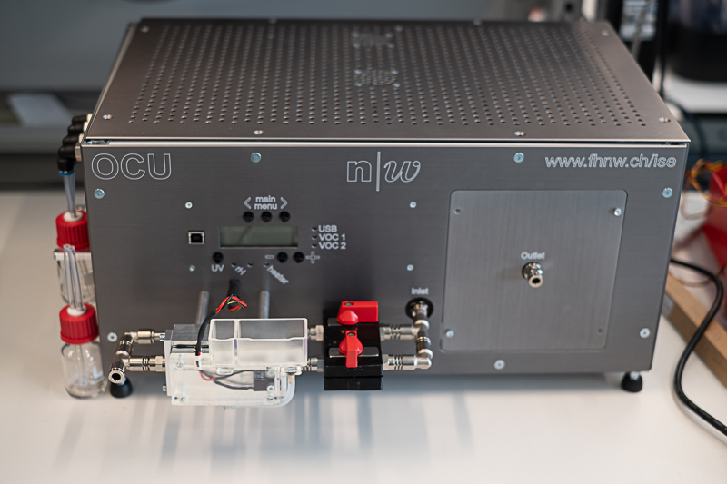|
|:--:| 
|*Front view of the organic coating unit, showing the control panle, inlet, humidifier and outlet. The VOC bottles are located on the left side of the device.*|
|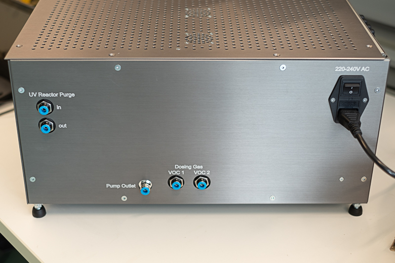|
|*Back view of the organic coating unit, showing the different gas connectors.*|

# Preparing the OCU for operation

### Additional Material

1. Precursor VOC (e.g. α-pinene)
2. High purity VOC-Free Synthetic air (e.g., Carbagas ALPHAGAZ™ 1)
3. Flow controller capable of delivering 2 lpm (e.g., Mass flow controller, critical orifice, etc.)
4. Recommended: Innert gas (e.g. N2) for purging of the oxidation flow reactor
5. Recommended: Festo blanking plugs for 6mm outer diameter tube (part Nr. QSC-6H)
6. Recommended: Reference isobutylene (C4H8) gas mixture (e.g. 100 ppm Isobutylene, N2 rest) for calibration purposes.
7. Optional: Ultra pure water (e.g. Milli-Q) for humidity experiments

## 1. Purging the oxidation flow reactor

The oxidation flow reactor consist of a UV-grade quartz tube surrounded by 5 mercury lamps. The reactor can be purged with an oxigen free gas, like N2, to avoid the formation of ozone outside of the reaction area. The purge inlet is located at the back of the OCU. It is enough to apply a low flow (e.g. 1 lpm) for 60 seconds in order to fill the reactor with the innert gas. The OCU is equipped with backflow prevention valves in order to keep the innert gas in the reactor. This opperation can be performed once a week.

|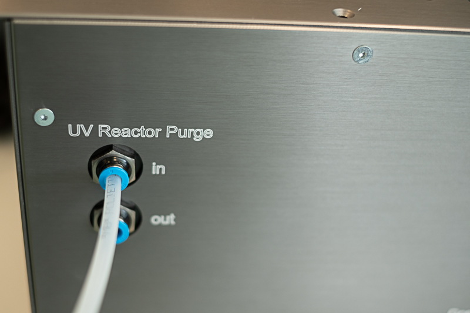|
|:--:| 
|*Inlet for purging the oxidation flow reactor of the OCU. This procedure avoids the formation of ozone outside of the reaction area. Backflow prevention valves keep the innert gas in the reactor area for several days.*|

## 2. Gas for VOC dosing

The OCU is equiped with two connectors for the VOC carrier gas. This way, it is possible to choose different gases for the two dosing systems or use, e.g., a premixed NO2 mixture for the second dosing loop. The VOC1 and VOC2 connectors correspond to the gas delivery system for the VOC bottles marked with those names at the left side of the device. **The required pressure for those connectors is 2 Bars**. A different pressure may cause an incorrect reading of the flow dupplied by the mass flow controllers inside the OCU. Inlets that are not in use should be closed with a  blanking plug. Failure to do so can result in leackage and contamination of the sample.

|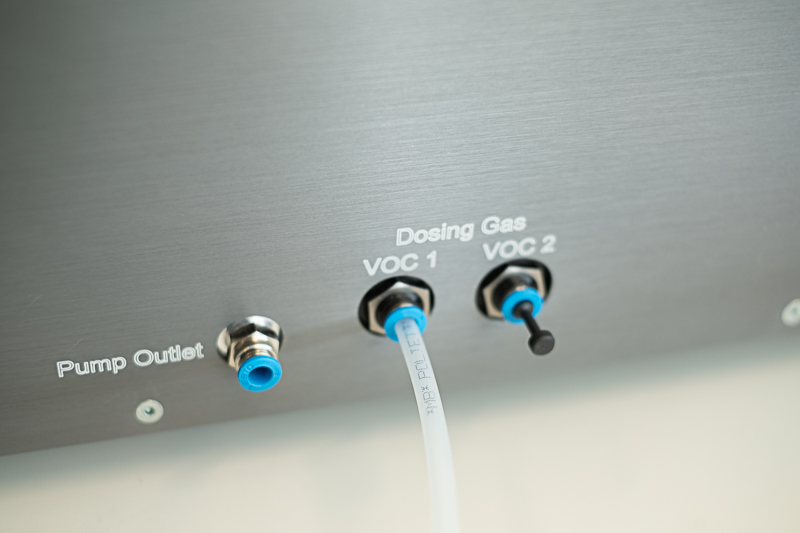|
|:--:| 
|*Connection of the carrier gas for the VOC1. The VOC2 can supplied with the same carrier gas or an alternative gas mixture. Keeped unused connectors closed using a blanking plug to avoid contamination of the sample.*| 

## 3. VOC precursor

Use the supplied 25ml bottles to for the VOC precursor. Typically, 5ml of liquid will allow for several hours of operation. We do not recommend using more than 10ml.  If one of the dosing bottles is missing, the corresponding inlet should be closed with a blanking plug.

**Important: The tube inside the bottle should never be bellow the liquid level.**

Note: The volatility of the precursor and the room temperature will determine the maximum and minimum achievable dosing concentration. Low volatility precursors, for instance substances that are solid at room temperature, require heating of the bottle, while very volatile substances may require active cooling. We are working towards a standarized solution for those special cases.

|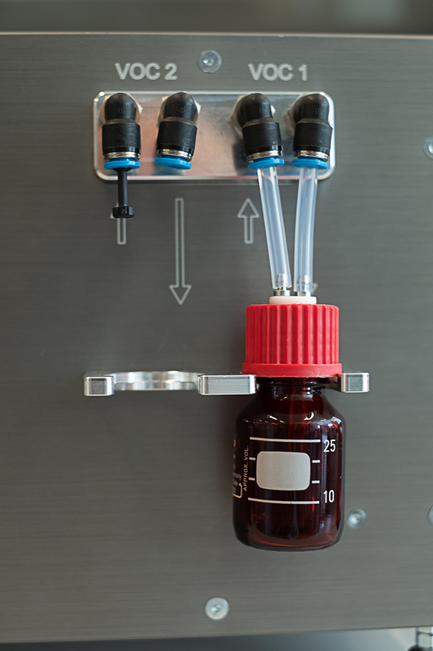|
|:--:| 
|*Bottle for VOC precursor at the left side of the OCU. Avoid overfilling the bottle, 5ml of liquid will usually allow for several hours of operation. Also be sure to close the VOC inlets that are not being used by means of a blanking plug.*| 

## 4. Humidifier

The humidifier located in front of the device provides a practical and reproducible moisture control. This help to switch the main oxidation path from ozone oxidation, when using dry air as a carrier gas, to a mixture of ozone and hydroxile oxidation when using humidified air. The following images will guide you through the steps for to prepare the humidifier for ozone/hydroxile experiments.

|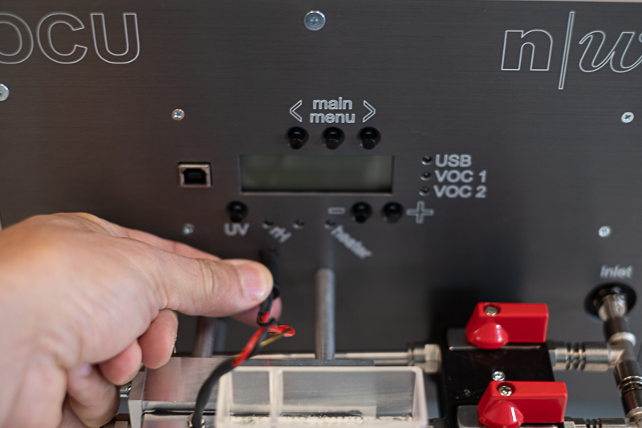|
|:--:| 
|1. Start by making sure that the humidifier is plugged to the control panel using the round connector.|
|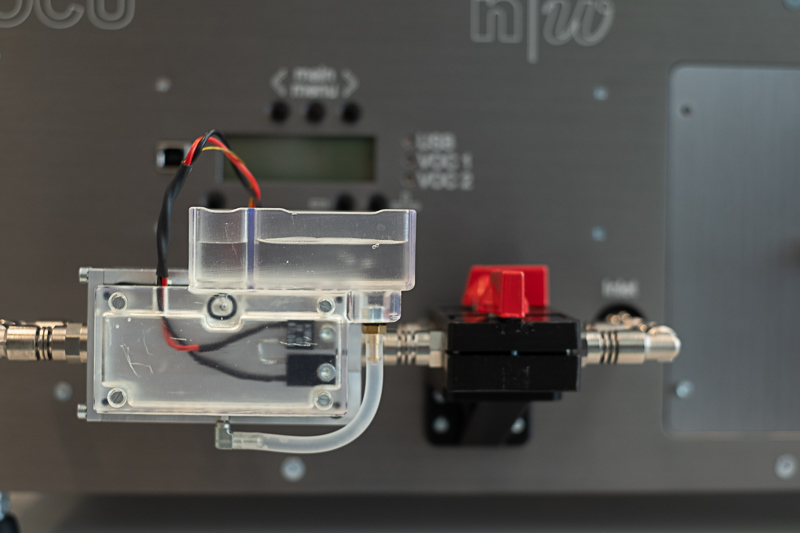|
|2. Fill large section (right) of the humidifier tank with high purity water, like Milli-Q water. As you fill the tank, the connecting tube will fill the humidifier and the smaller tank on the left side. This procedure prevents the formation of air bubbles. Make sure the tube is connected to both tanks before starting to pour water. During the experiemnt, the transparent material of the tank will help you to monitor water consumption during the experiment. Refill as necesary.|
|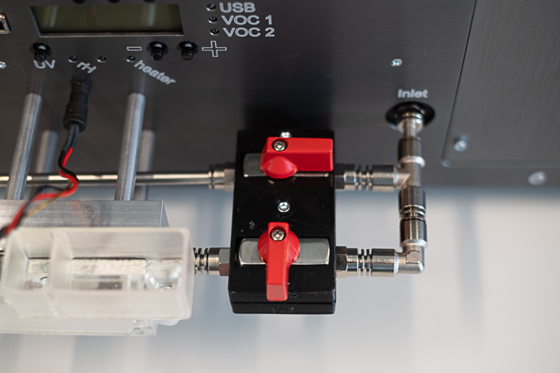|
|3a. **Dry operation mode:** Front valve closed and back valve open. If the tank is full of water, avoiding the front part is the only way to keep the carrier gas dry.|
|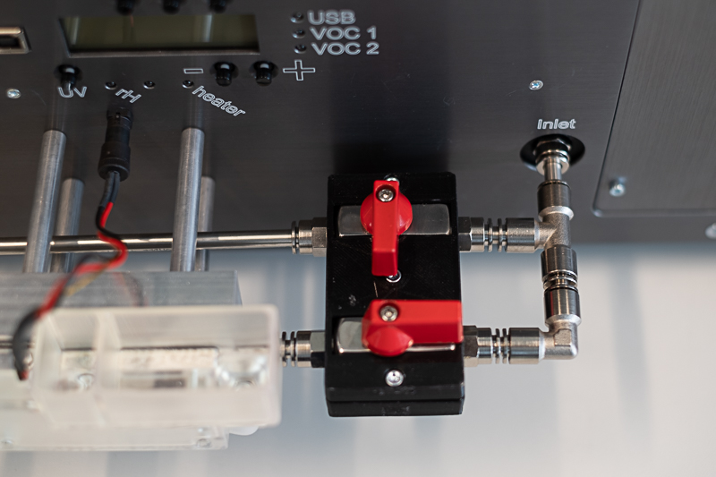|
|3b. **Humidity control mode:** Front valve open and back valve closed. The minimum and maximum achievable humidity depend on factors like flow rate and room temperature. The set point for the relative humidity can be selected later using the graphical user interface on the microcomputer.|
|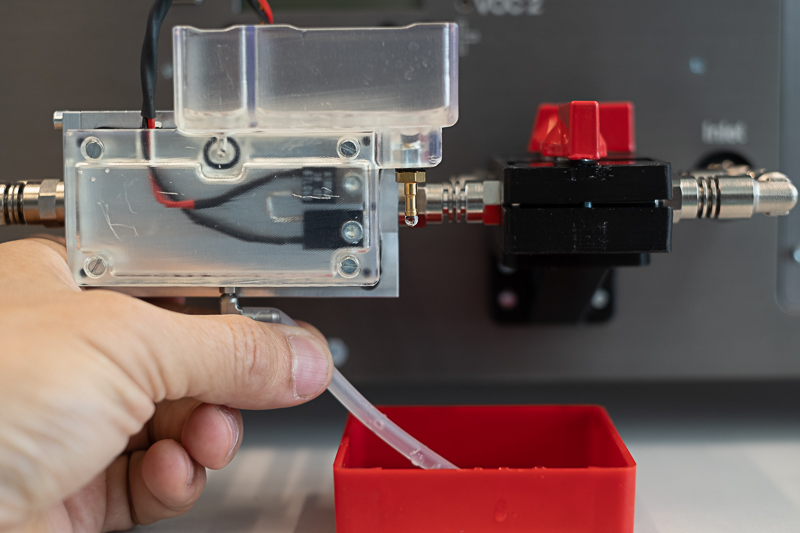|
|4. Never leave the water tank filled with water when the instrument is not in use. This will prevent condensation of water on the tubes. Empty the tank by disconnecting the tube from one of the tanks. Use a small container on the bottom to collect the water.|

## 5. Connecting the microcomputer

You are almost there, the final step is to connect the microcomputer to the OCU. Use a USB cable to connect one of the microcomputer's USB ports to the front pannel of the OCU. There is no switch on the microcomputer, it will be turned on when connecting the USB power supply. Once the microcomputer is on, the user interface will start as soon as the OCU is turned on. It is also possible to turn the OCU before the microcomputer. You will need to restart the microcomputer if the OCU is turned off and back on. 

Anytime you can press the <kbd>Windows</kbd>-key to access the start menu of the operating system or <kbd>Alt</kbd> + <kbd>F11</kbd> to toggle the GUI between maximized and window-view mode.

Note: The OCU has a touch screen but it is easier to operate using a keyboard and a mouse (not supplied).

|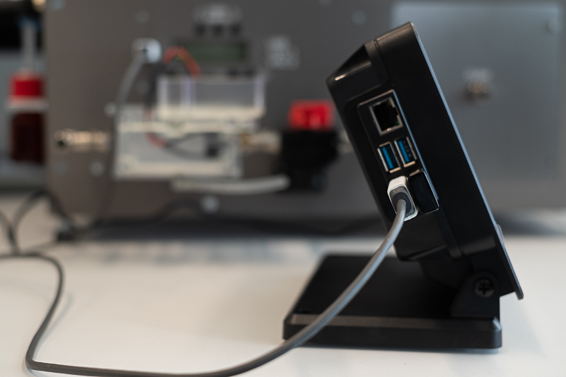|
|:--:| 
|*USB connectors at the microcomputer. Also keyboard and a mouse can be connected here as an alternative to the touch screen.*|
|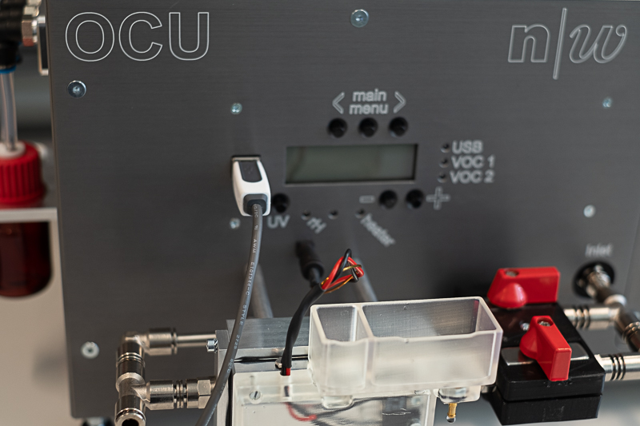|
|*USB connector at the OCU for the microcomputer*|
|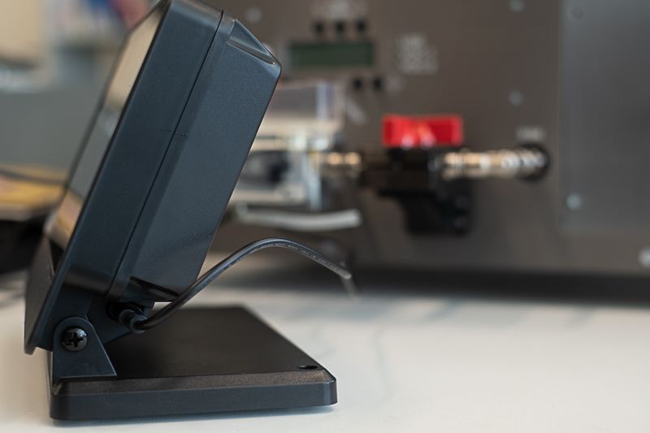|
|*Microcomputer power supply. Always use the supplied power supply or a 15 Watt supply compatible with a raspberry pi 4.*|

# The Graphical user interface

|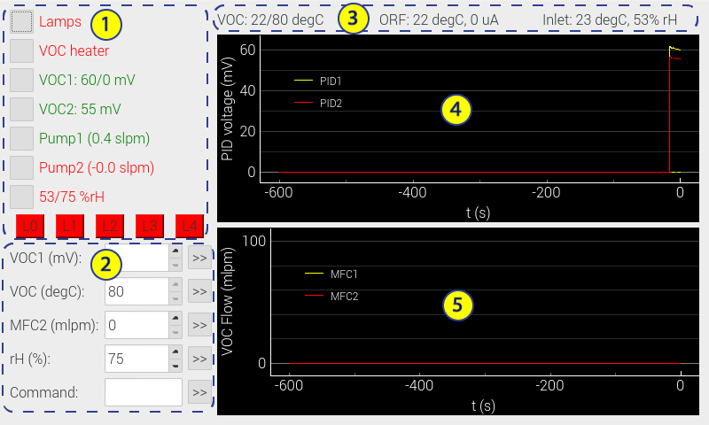|
|:--:|
|*Graphical User Interface of the OCU Microcomputer.*|

### 1. The button section

This section allows the user to toggle commands that start or stop a certain behaviour. Green text means "on", whereas red means "off". 

* **Lamps**: Switches all UV lamps of the OFR on or off at once.
* **VOC heater**: Start/Stop the tube heater for the VOC1 delivery, the temperature set point needs to be established in "section 2" of the GUI. High temperatures prevent depositio of the VOC in the tube.
* **VOC1** *is-value/target-value* mV: Switches the VOC1 photoionization detector on or off. The curent reading of the detector and the target set point are displayed in mV. Offset and span of signal needs to determined (see [calibration section](#calibrating-the-photoionization-detector)).
* **VOC2** *is-value* mV: Switches the VOC1 photoionization detector on or off. The second dosing is done at a fixed carrier gas flow. Thus, only the current mV reading is displayed.
* **Pump1** (*is-flow* in lpm): Switches the pump for the photoionization detector #1 (VOC1) on or off. This can be done independently of the sensor to, e.g., start the preheating of the sensor prior to an experiment. The set point for the flow can be modified via the *F1xxx* serial command of the [set-points section](#2-set-points-section) of the GUI.
* **Pump2** (*is-flow* in lpm): Switches the pump for the photoionization #2 (VOC2) detector on or off. This can be done independently of the sensor to, e.g., start the preheating of the sensor prior to an experiment. The set point for the flow can be modified via the *F2xxx* serial command of the [set-points section](#2-set-points-section) of the GUI.
* is-value/target-value **%rH**: Switches the humidity control for the OCU on and off. The measured value corresponds to the relative humidity of the sample entering the OCU (shown on [OCU status](#3-ocu-status) section). The target value can be adjusted on the [set-points section](#2-set-points-section) of the GUI.
* **L1** through **L4**: Toggles individual lamps on and off. This buttons create less reactive species in OFR compared to the full UV intensity of the lamps. The UV intensity as measured by a photodiode is displayed on the [OCU status](#3-ocu-status) section. 

### 2. Set-points section

This section allos the user to modify the control loops set points or send serial commands to the OCU. Press <kbd>>></kbd> to the right of the input field to set the new value.

* **VOC1**: Sets the target concentration in mV for the control loop of the VOC1 precursor. See [calibration section](#calibrating-the-photoionization-detector)
* **VOC**: Sets the temperature in °C for the VOC1 tube heater. Maximum temperature is 80°C. Heating has the purpose of preventing deposition on the tube. Also, the temperature can be increased to clean the tube when changing the precursor substance.
* **MFC2**: Set the flow of mass flow controller dosing the VOC2 precursor. This precursor is not controlled via a control loop. The actual concentratration will depend on the flow rates, the volatility of the compound and the ambient temperature.
* **rH**: Sets the target humidity value for the control loop. The reference temperature is the one measured at the inlet (see [OCU status](#3-ocu-status) section). The humidifier needs to be set as described in the [humidifier section](#4-humidifier).
* **Command**: Sends a serial command to the instrument. See the [serial commands reference](#serial-commands).

### 3. OCU Status

From left to right, this line displays the VOC1 tube heater temperature (measured value/set value), the oxidation flow reactor temperature and measured phoelectric current (proportional to UV light intensity), and the temperature and relative humidity measured at the inlet.

### 4. Photoionization Detector Voltage

This graph shows the voltage measured by the photoionization detector. Only the active PID detectors are shown. Voltages can be transformed to VOC concentrations based on a [calibration](#calibrating-the-photoionization-detector).

### 5. VOC Flow

This graph shows the dosing flow going through the VOC1 and VOC2 precursor bottles. The VOC1 flow is controlled by a control loop, based on a targed precursor concentration, whereas the VOC2 flow is manually controlled by the user.

## Serial Commands

**Important:** Commands are case sensitive!

|Command|Function|Range|Example|
|:------------|:------------|--:|:--|
|Cx1   |Switch the PID #x on   |1-2 |C11 |
|Cx0   |Switch the PID #x off  |1-2 |C10 | 
|Ex1   |Switch the Pump #x on  |1-2 |E21 |
|Ex0   |Switch the Pump #x off |1-2 |E20 |
|F1xxx |Setpoint PID1 pump in ml/minute | 0-999 | F1500 |
|F2xxx |Setpoint PID2 pump in ml/minute | 0-999 | F2300 |
|M0xxx |Setpoint for MFC2 (VOC2 dosing) in ml/minute | 0-100 | M0050 |
|Pxxxx |Setpoint VOC1 in mV | 1-2500 | P0500 |
|qx    |Switch the VOC Tube heater on (1) or off (0) | 0-1 | q1 |
|rx    |Switch the humidifier on (1) or off (0) | 0-1 | r1 |
|Q00xx |Set the VOC tube heater target temperature | 1-80 | Q0070 |
|R00xx |Set the humidifier target humidity | 1-99 | R0065 |
|Z1    |Set the current PID mV values to zero (baseline). PID must be turned on before (*Cx1* command). **Use with caution!** | - | Z1 |
|z1    |Reset baseline set by the *Z1* command. | - | z1 |

## Configuring the microcomputer

The microcomputer is a raspberry pi model 4. It runs on the Linux-based Raspbian operating system. The python based software for control and data logging is preinstalled on the device, and is configured for an automatic start when the OCU and the microcomputer are connected. The microcomputer clock needs to be synchronized for a correct timestamp on the logfile. This can be performed automatically by setting the correct time zone and configuring the network access[^2] on a Network Time Protocol (NTP) enabled network. Make sure that the NTP port, port number 123, is enabled by your firewall. Alternativally, the clock can be set manually through the command line using the `date` command (e.g. `sudo date -s 'YYYY-MM-DD HH:MM:SS'`). The command line is accesible at any moment using the key combination <kbd>Ctrl</kbd>+<kbd>Alt</kbd>+<kbd>t</kbd>.

It is possible to install the software on an alternative computer. So far, we have only tested the python scripts under the Raspberry Pi OS and under Ubuntu running on a laptop computer. It should however be possible to use them also under Windows or Mac OS. Follow [these instructions](../../README.md) to install the scripts.

Further configuration of the microcomputer can be performed following the Raspberry Pi OS guide[^1].

## Accessing the log files

By default, the generated log files can be found under `~/ocu/data` (unless you have pointed to another directory in the `config.ini` file). You can use the command line, accesible through <kbd>Ctrl</kbd>+<kbd>Alt</kbd>+<kbd>t</kbd>, or the file manager graphical application to access them or to copy them to a USB drive. The graphical file manager can be accesed through the start menu of the operating system (press <kbd>Windows</kbd>-key). File naming convention is `YYMMDD-HHMMSS-OCU-SNx.txt`, where x refers to the serial number of the device.

|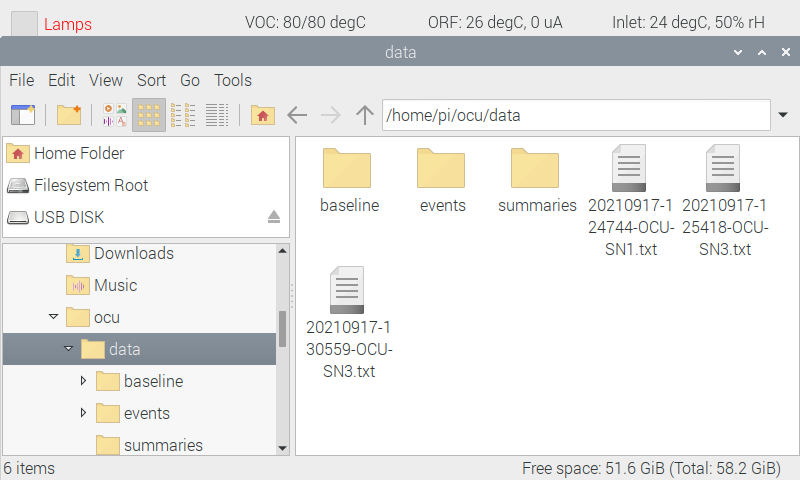|
|:--:|
|*Accesing the log files through the graphical interface of the microcomputer*|

# Experimental Setup

## Generation of Pure Secondary Organic Matter Particles by Homogeneous Nucleation

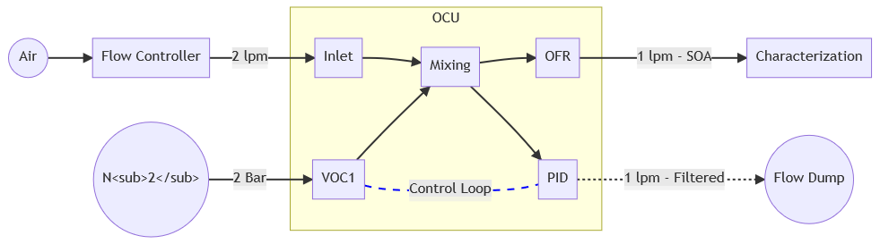

## Coating of Particles with Secondary Organic Matter

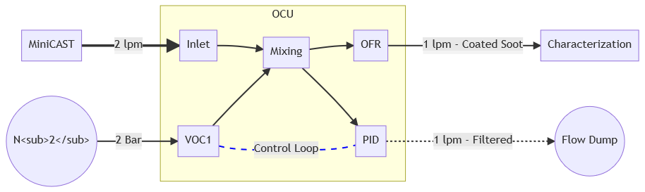

# Calibrating the photoionization detector

Alphasense table of VOC Correction factors[^3]

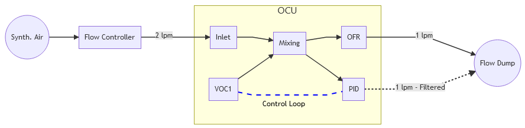

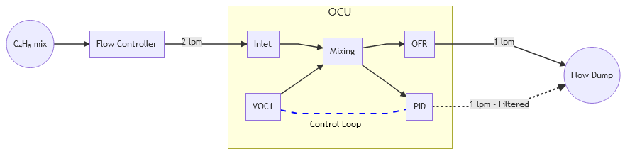

# Mantainance

## PID Sensors

The OCU uses two [Alphasense](https://www.alphasense.com/) photoionization detectors PID-A1 Rev 2 (VOCs up to 4,000ppm). Replacement sensors can be ordered directly by the manufacturer. When doing so, be sure to stress that the you require **regulator enabled PID sensors (Part Number 000-0U22-A12)**. Alphasense offers a detailed introduction to photoionization detection[^4], application notes[^5] for use and mantainance, as well as datasheets[^6].

### Accesing the PID Sensors for cleaning or replacement

## Changing the particle filters

## OFR UV Lamp replacement

The oxidation flow reactor uses five [Hereaus](https://www.heraeus.com) low pressure mercury lamps to generate ozone. The light intensity of the lamps is registered in the automatically generated logfiles. Lamps can be tested individually by turning them on one at a time using the [graphical user interface](#the-graphical-user-interface). Replacement lamps can be ordered directly by representatives. The following table lists key details about the lamp: 

|Manufacturer|Hereaus|
|:--|:--|
|Lamp Model |GPH212T5VH/4|
|Type       |Low pressure, ozone generating|
|Length     |212mm|
|Arc length |132mm|
|Tube diameter|15mm|
|Lamp Power |10W|
|UV-C Output|2.7W at 254nm|
|Connection |4-Pin Single Ended|

Follow this procedure procedure for lamp replacement:

**include graphical procedure for access/replacement of lamps**

# Useful links

[^1]: [Raspberry Pi OS guide](https://www.raspberrypi.org/documentation/computers/os.html)
[^2]: Raspberry pi OS documentation [for network configuration](https://www.raspberrypi.org/documentation/computers/configuration.html#configuring-networking)
[^3]: Alphasense table of [VOC Correction factors](https://www.alphasense.com/wp-content/uploads/2017/05/AAN-305-06.pdf)
[^4]: Alphasense [introduction to photoionization detection (PID)](https://www.alphasense.com/wp-content/uploads/2013/07/AAN_301-04.pdf)
[^5]: Alphasense [Photoionization Detector application notes](https://www.alphasense.com/downloads/application-notes/)
[^6]: Alphasense [PID A12 Datasheet](https://www.alphasense.com/wp-content/uploads/2019/08/PID-A12-1.pdf)
