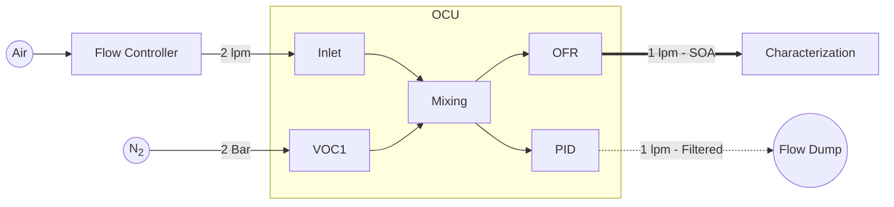
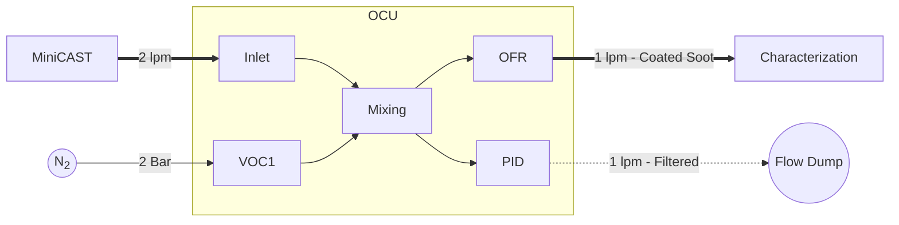

# Organic Coating Unit: Quick Start Manual

# Introduction

# Setting up the OCU for SOM particle production

## Material

1. The organic coating unit
2. Microcomputer
3. VOC containers
5. Sample VOC (e.g. α-pinene)
6. VOC-Free Synthetic air (e.g., Carbagas ALPHAGAZ™ 1 Air)
7. Flow controller capable of delivering 2 lpm (e.g., Mass flow controller, critical orifice, etc.).
8. Innert gas (e.g. N2) for VOC dosage and purging the OFR
9. Ultra pure water (e.g. Milli-Q) for humidity experiments
10. 

## The organic coating unit (OCU)

## Preparing the OCU for operation

Follow this procedures before the innitial operation.

### 1. Purging the oxidation flow reactor

The coating unit 

## Setup

