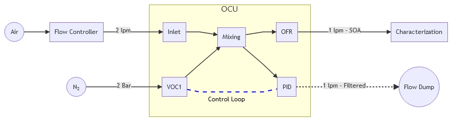
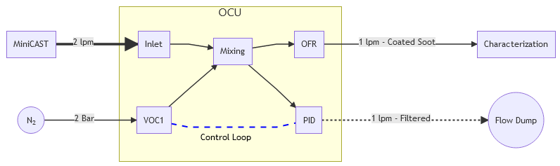

# Organic Coating Unit: Quick Start Manual

# Introduction

# Preparing the OCU for operation

This short guide will take you through the necessary steps for your first production of secondary organic aerosol (SOA) particles.

### Additional Material

1. Precursor VOC (e.g. α-pinene)
2. High purity VOC-Free Synthetic air (e.g., Carbagas ALPHAGAZ™ 1)
3. Flow controller capable of delivering 2 lpm (e.g., Mass flow controller, critical orifice, etc.)
4. Recommended: Innert gas (e.g. N2) for purging of the oxidation flow reactor
5. Recommended: Festo blanking plugs for 6mm outer diameter tube (part Nr. QSC-6H)
6. Optional: Ultra pure water (e.g. Milli-Q) for humidity experiments

## 1. Purging the oxidation flow reactor

The oxidation flow reactor consist of a UV-grade quartz tube surrounded by 5 mercury lamps. The reactor can be purged with an oxigen free gas, like N2, to avoid the formation of ozone outside of the reaction area. The purge inlet is located at the back of the OCU. It is enough to apply a low flow (e.g. 1 lpm) for 60 seconds in order to fill the reactor with the innert gas. The OCU is equipped with backflow prevention valves in order to keep the innert gas in the reactor. This opperation can be performed once a week.

||
|:--:| 
|*Inlet for purging the oxidation flow reactor of the OCU. This procedure avoids the formation of ozone outside of the reaction area. Backflow prevention valves keep the innert gas in the reactor area for several days.*|

## 2. Gas for VOC dosing

The OCU is equiped with two connectors for the VOC carrier gas. This way, it is possible to choose different gases for the two dosing systems or use, e.g., a premixed NO2 mixture for the second dosing loop. The VOC1 and VOC2 connectors correspond to the gas delivery system for the VOC bottles marked with those names at the left side of the device. **The required pressure for those connectors is 2 Bars**. A different pressure may cause an incorrect reading of the flow dupplied by the mass flow controllers inside the OCU. Inlets that are not in use should be closed with a  blanking plug. Failure to do so can result in leackage and contamination of the sample.

||
|:--:| 
|*Connection of the carrier gas for the VOC1. The VOC2 can supplied with the same carrier gas or an alternative gas mixture. Keeped unused connectors closed using a blanking plug to avoid contamination of the sample.*| 

## 3. VOC precursor

Use the supplied 25ml bottles to for the VOC precursor. Typically, 5ml of liquid will allow for several hours of operation. We do not recommend using more than 10ml.  If one of the dosing bottles is missing, the corresponding inlet should be closed with a blanking plug.

**Important: The tube inside the bottle should never be bellow the liquid level.**

Note: The volatility of the precursor and the room temperature will determine the maximum and minimum achievable dosing concentration. Low volatility precursors, for instance substances that are solid at room temperature, require heating of the bottle, while very volatile substances may require active cooling. We are working towards a standarized solution for those special cases.

||
|:--:| 
|*Bottle for VOC precursor at the left side of the OCU. Avoid overfilling the bottle, 5ml of liquid will usually allow for several hours of operation. Also be sure to close the VOC inlets that are not being used by means of a blanking plug.*| 

## 4. Humidifier

The humidifier located in front of the device provides a practical and reproducible moisture control. This help to switch the main oxidation path from ozone oxidation, when using dry air as a carrier gas, to a mixture of ozone and hydroxile oxidation when using humidified air. The following images will guide you through the steps for to prepare the humidifier for ozone/hydroxile experiments.

||
|:--:| 
|1. Start by making sure that the humidifier is plugged to the control panel using the round connector.|
||
|2. Fill large section (left) of the humidifier tank with high purity water, like Milli-Q water. As you fill the tank, the tube in the bottom will fill up the comunicating tank on the right. This prevents the formation of air bubbles. Make sure the tube is connected to both tanks before starting to pour water. During the experiemnt, the transparent material of the tank will help you to monitor water consumption during the experiment. Refill as necesary.|
||
|3a. **Dry operation mode:** Front valve closed and back valve open. If the tank is full of water, avoiding the front part is the only way to keep the carrier gas dry.|
||
|3b. **Humidity control mode:** Front valve open and back valve closed. The minimum and maximum achievable humidity depend on factors like flow rate and room temperature. The set point for the relative humidity can be selected later using the graphical user interface on the microcomputer.|
||
|4. Never leave the water tank filled with water when the instrument is not in use. This will prevent condensation of water on the tubes. Empty the tank by disconnecting the tube from one of the tanks. Use a small container on the bottom to collect the water.|

## 5. Connecting the microcomputer

You are almost there, the final step is to connect the microcomputer to the OCU. Use a USB cable to connect one of the microcomputer's USB ports to the front pannel of the OCU. There is no switch on the microcomputer, it will be turned on when connecting the USB power supply. Once the microcomputer is on, the user interface will start as soon as the OCU is turned on. It is also possible to turn the OCU before the microcomputer. You will need to restart the microcomputer if the OCU is turned off and back on. 

Anytime you can press the <kbd>Windows</kbd>-key to access the start menu of the operating system or <kbd>Alt</kbd> + <kbd>F11</kbd> to toggle the GUI between maximized and window-view mode.

Note: The OCU has a touch screen but it is easier to operate using a keyboard and a mouse (not supplied).

||
|:--:| 
|*USB connectors at the microcomputer. Also keyboard and a mouse can be connected here as an alternative to the touch screen.*|
||
|*USB connector at the OCU for the microcomputer*|
||
|*Microcomputer power supply. Always use the supplied power supply or a 15 Watt supply compatible with a raspberry pi 4.*|

# The Graphical user interface

||
|:--:|
|*Graphical User Interface of the OCU Microcomputer.*|

### 1. The button section

This section allows the user to toggle commands that start or stop a certain behaviour. Green text means "on", whereas red means "off". 

* **Lamps**: Switches all UV lamps of the OFR on or off at once.
* **VOC heater**: Start/Stop the tube heater for the VOC1 delivery, the temperature set point needs to be established in "section 2" of the GUI. High temperatures prevent depositio of the VOC in the tube.
* **VOC1** *is-value/target-value* mV: Switches the VOC1 photoionization detector on or off. The curent reading of the detector and the target set point are displayed in mV. Offset and span of signal needs to determined (see [calibration section](#calibrating-the-photoionization-detector)).
* **VOC2** *is-value* mV: Switches the VOC1 photoionization detector on or off. The second dosing is done at a fixed carrier gas flow. Thus, only the current mV reading is displayed.
* **Pump1** (*is-flow* in lpm): Switches the pump for the photoionization detector #1 (VOC1) on or off. This can be done independently of the sensor to, e.g., start the preheating of the sensor prior to an experiment. The set point for the flow can be modified via serial command on the [set-points section](#2-set-points-section) of the GUI.
* **Pump2** (*is-flow* in lpm): Switches the pump for the photoionization #2 (VOC2) detector on or off. This can be done independently of the sensor to, e.g., start the preheating of the sensor prior to an experiment. The set point for the flow can be modified via serial command on the [set-points section](#2-set-points-section) of the GUI.
* is-value/target-value **%rH**: Switches the humidity control for the OCU on and off. The measured value corresponds to the relative humidity of the sample entering the OCU (shown on [OCU status](#3-ocu-status) section). The target value can be adjusted on the [set-points section](#2-set-points-section) of the GUI.
* **L1** through **L4**: Toggles individual lamps on and off. This buttons create less reactive species in OFR compared to the full UV intensity of the lamps. The UV intensity as measured by a photodiode is displayed on the [OCU status](#3-ocu-status) section. 

### 2. Set-points section

This section allos the user to modify the control loops set points or send serial commands to the OCU. Press <kbd>>></kbd> to the right of the input field to set the new value.

* **VOC1**: Sets the target concentration in mV for the control loop of the VOC1 precursor. See [calibration section](#calibrating-the-photoionization-detector)
* **VOC**: Sets the temperature in °C for the VOC1 tube heater. Maximum temperature is 80°C. Heating has the purpose of preventing deposition on the tube. Also, the temperature can be increased to clean the tube when changing the precursor substance.
* **MFC2**: Set the flow of mass flow controller dosing the VOC2 precursor. This precursor is not controlled via a control loop. The actual concentratration will depend on the flow rates, the volatility of the compound and the ambient temperature.
* **rH**: Sets the target humidity value for the control loop. The reference temperature is the one measured at the inlet (see [OCU status](#3-ocu-status) section). The humidifier needs to be set as described in the [humidifier section](#4-humidifier).
* **Command**: Sends a serial command to the instrument. See the [serial commands reference](#serial-commands).

### 3. OCU Status

From left to right, this line displays the VOC1 tube heater temperature (measured value/set value), the oxidation flow reactor temperature and measured phoelectric current (proportional to UV light intensity), and the temperature and relative humidity measured at the inlet.

### 4. Photoionization Detector Voltage

This graph shows the voltage measured by the photoionization detector. Only the active PID detectors are shown. Voltages can be transformed to VOC concentrations based on a [calibration](#calibrating-the-photoionization-detector).

### 5. VOC Flow

This graph shows the dosing flow going through the VOC1 and VOC2 precursor bottles. The VOC1 flow is controlled by a control loop, based on a targed precursor concentration, whereas the VOC2 flow is manually controlled by the user.

## Serial Commands

# Calibrating the photoionization detector

# Experimental Setup

## Generation of Pure Secondary Organic Matter Particles by Homogeneous Nucleation

## Coating of Particles with Secondary Organic Matter

# Useful links

* Raspberry pi OS documentation [for network configuration](https://www.raspberrypi.org/documentation/computers/configuration.html#configuring-networking)
* Alphasense [Photoionization Detector application notes](https://www.alphasense.com/downloads/application-notes/)
* Alphasense [introduction to photoionization detection (PID)](https://www.alphasense.com/wp-content/uploads/2013/07/AAN_301-04.pdf)
* Alphasense table of [VOC Correction factors](https://www.alphasense.com/wp-content/uploads/2017/05/AAN-305-06.pdf)
