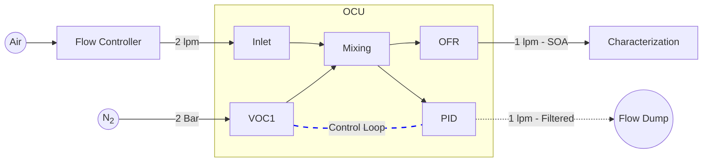
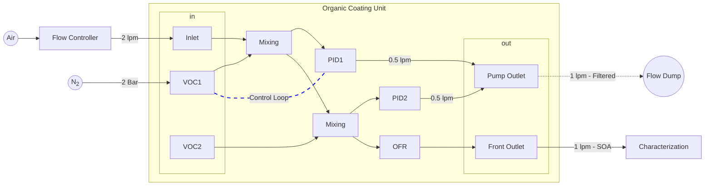
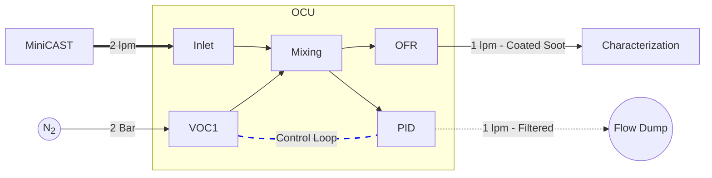
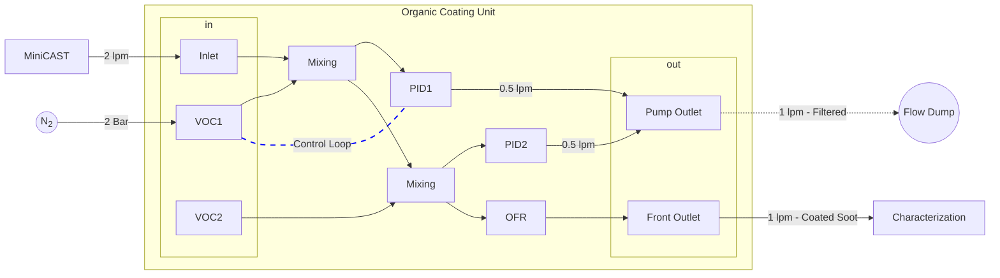
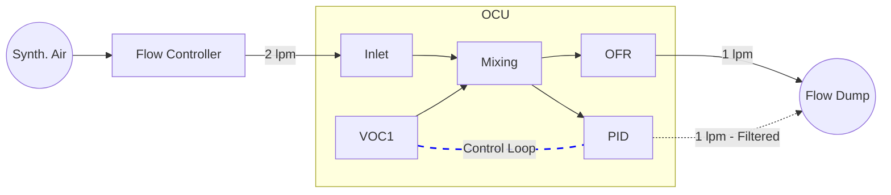
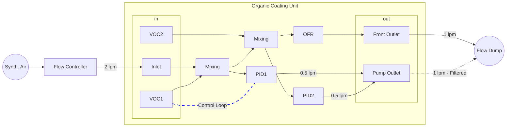
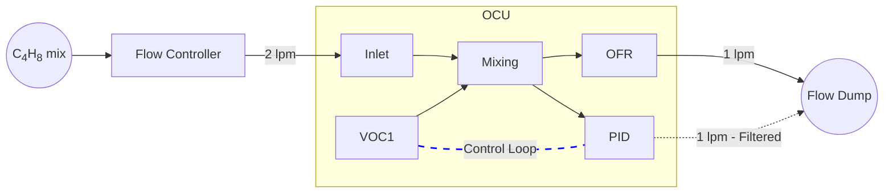
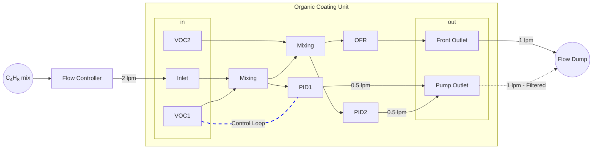

## Generation of Pure Secondary Organic Matter Particles by Homogeneous Nucleation

```mermaid
graph LR
subgraph OCU
         Inlet[Inlet] --> Mixing
         Mixing --> OFR
         VOC1 --> Mixing
         Mixing --> PID
         VOC1 -.-|Control Loop| PID
         end
A((Air)) --> B[Flow Controller] 
B  --> |2 lpm| Inlet
D((N<sub>2</sub>)) --> |2 Bar| VOC1
OFR --> |1 lpm - SOA| E[Characterization]
PID -.1 lpm - Filtered.-> F((Flow Dump))
linkStyle 4 stroke:blue,stroke-width:2px,curve:natural,stroke-dasharray: 8 8;
```

```mermaid
graph LR
subgraph Organic Coating Unit
         subgraph in
                  Inlet[Inlet]
                  VOC1
                  VOC2
                  end
         subgraph out
                  FO[Front Outlet]
                  PO[Pump Outlet]
                  end
         Inlet --> Mixing
         VOC1 --> Mixing
         VOC2 --> M2[Mixing]
         Mixing --> PID1
         VOC1 -.-|Control Loop| PID1
         Mixing --> M2
         M2 --> PID2
         PID1 --> |0.5 lpm| PO
         PID2 --> |0.5 lpm| PO
         M2 --> OFR
         OFR --> FO
         end
A((Air)) --> B[Flow Controller] 
B  --> |2 lpm| Inlet
D((N<sub>2</sub>)) --> |2 Bar| VOC1
FO --> |1 lpm - SOA| E[Characterization]
PO -.1 lpm - Filtered.-> F((Flow Dump))
linkStyle 4 stroke:blue,stroke-width:2px,curve:natural,stroke-dasharray: 8 8;
```

## Coating of Particles with Secondary Organic Matter

```mermaid
graph LR
subgraph OCU
         Inlet[Inlet] --> Mixing
         Mixing --> OFR
         VOC1 --> Mixing
         Mixing --> PID
         VOC1 -.-|Control Loop| PID
         end
A[MiniCAST] ==> |2 lpm| Inlet
D((N<sub>2</sub>)) --> |2 Bar| VOC1
OFR --> |1 lpm - Coated Soot| E[Characterization]
PID -.1 lpm - Filtered.-> F((Flow Dump))
linkStyle 4 stroke:blue,stroke-width:2px,curve:natural,stroke-dasharray: 8 8;
```

```mermaid
graph LR
subgraph Organic Coating Unit
         subgraph in
                  Inlet[Inlet]
                  VOC1
                  VOC2
                  end
         subgraph out
                  FO[Front Outlet]
                  PO[Pump Outlet]
                  end
         Inlet --> Mixing
         VOC1 --> Mixing
         VOC2 --> M2[Mixing]
         Mixing --> PID1
         VOC1 -.-|Control Loop| PID1
         Mixing --> M2
         M2 --> PID2
         PID1 --> |0.5 lpm| PO
         PID2 --> |0.5 lpm| PO
         M2 --> OFR
         OFR --> FO
         end
B[MiniCAST] 
B  --> |2 lpm| Inlet
D((N<sub>2</sub>)) --> |2 Bar| VOC1
FO --> |1 lpm - Coated Soot| E[Characterization]
PO -.1 lpm - Filtered.-> F((Flow Dump))
linkStyle 4 stroke:blue,stroke-width:2px,curve:natural,stroke-dasharray: 8 8;
```

## Zero point

```mermaid
graph LR
subgraph OCU
         Inlet[Inlet] --> Mixing
         Mixing --> OFR
         VOC1 --> Mixing
         Mixing --> PID
         VOC1 -.-|Control Loop| PID
         end
A((Synth. Air)) --> B[Flow Controller]
B  --> |2 lpm| Inlet
OFR --> |1 lpm | F((Flow Dump))
PID -.1 lpm - Filtered.-> F
linkStyle 4 stroke:blue,stroke-width:2px,curve:natural,stroke-dasharray: 8 8;
```

```mermaid
graph LR
subgraph Organic Coating Unit
         subgraph in
                  Inlet[Inlet]
                  VOC1
                  VOC2
                  end
         subgraph out
                  FO[Front Outlet]
                  PO[Pump Outlet]
                  end
         Inlet --> Mixing
         VOC1 --> Mixing
         VOC2 --> M2[Mixing]
         Mixing --> PID1
         VOC1 -.-|Control Loop| PID1
         Mixing --> M2
         M2 --> PID2
         PID1 --> |0.5 lpm| PO
         PID2 --> |0.5 lpm| PO
         M2 --> OFR
         OFR --> FO
         end
A((Synth. Air)) --> B[Flow Controller]  
B  --> |2 lpm| Inlet
FO --> |1 lpm| F((Flow Dump))
PO -.1 lpm - Filtered.-> F
linkStyle 4 stroke:blue,stroke-width:2px,curve:natural,stroke-dasharray: 8 8;
```

## Calibration

```mermaid
graph LR
subgraph OCU
         Inlet[Inlet] --> Mixing
         Mixing --> OFR
         VOC1 --> Mixing
         Mixing --> PID
         VOC1 -.-|Control Loop| PID
         end
A((C<sub>4</sub>H<sub>8</sub> mix)) --> B[Flow Controller]
B  --> |2 lpm| Inlet
OFR --> |1 lpm | F((Flow Dump))
PID -.1 lpm - Filtered.-> F
linkStyle 4 stroke:blue,stroke-width:2px,curve:natural,stroke-dasharray: 8 8;
```

```mermaid
graph LR
subgraph Organic Coating Unit
         subgraph in
                  Inlet[Inlet]
                  VOC1
                  VOC2
                  end
         subgraph out
                  FO[Front Outlet]
                  PO[Pump Outlet]
                  end
         Inlet --> Mixing
         VOC1 --> Mixing
         VOC2 --> M2[Mixing]
         Mixing --> PID1
         VOC1 -.-|Control Loop| PID1
         Mixing --> M2
         M2 --> PID2
         PID1 --> |0.5 lpm| PO
         PID2 --> |0.5 lpm| PO
         M2 --> OFR
         OFR --> FO
         end
A((C<sub>4</sub>H<sub>8</sub> mix)) --> B[Flow Controller]  
B  --> |2 lpm| Inlet
FO --> |1 lpm| F((Flow Dump))
PO -.1 lpm - Filtered.-> F
linkStyle 4 stroke:blue,stroke-width:2px,curve:natural,stroke-dasharray: 8 8;
```
