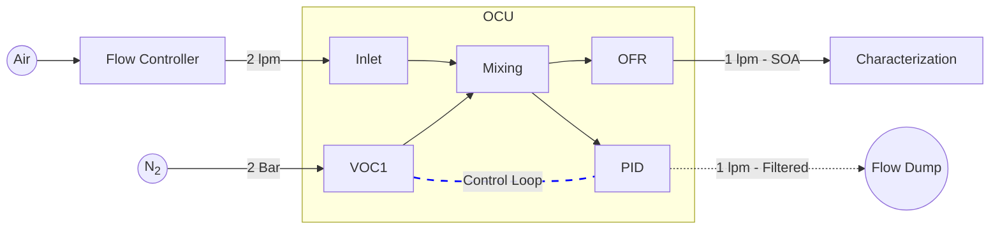
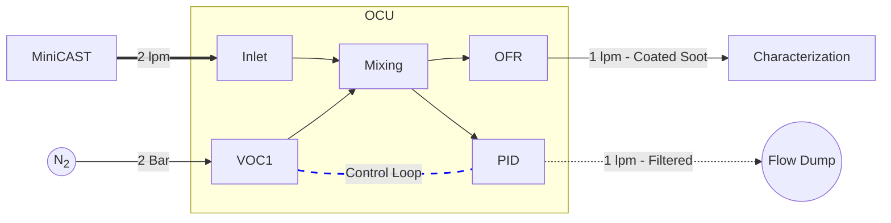

## Generation of Pure Secondary Organic Matter Particles by Homogeneous Nucleation

```mermaid
graph LR
subgraph OCU
         Inlet[Inlet] --> Mixing
         Mixing --> OFR
         VOC1 --> Mixing
         Mixing --> PID
         VOC1 -.-|Control Loop| PID
         end
A((Air)) --> B[Flow Controller] 
B  --> |2 lpm| Inlet
D((N<sub>2</sub>)) --> |2 Bar| VOC1
OFR --> |1 lpm - SOA| E[Characterization]
PID -.1 lpm - Filtered.-> F((Flow Dump))
linkStyle 4 stroke:blue,stroke-width:2px,curve:natural,stroke-dasharray: 8 8;
```

## Coating of Particles with Secondary Organic Matter

```mermaid
graph LR
subgraph OCU
         Inlet[Inlet] --> Mixing
         Mixing --> OFR
         VOC1 --> Mixing
         Mixing --> PID
         VOC1 -.-|Control Loop| PID
         end
A[MiniCAST] ==> |2 lpm| Inlet
D((N<sub>2</sub>)) --> |2 Bar| VOC1
OFR --> |1 lpm - Coated Soot| E[Characterization]
PID -.1 lpm - Filtered.-> F((Flow Dump))
linkStyle 4 stroke:blue,stroke-width:2px,curve:natural,stroke-dasharray: 8 8;
```
